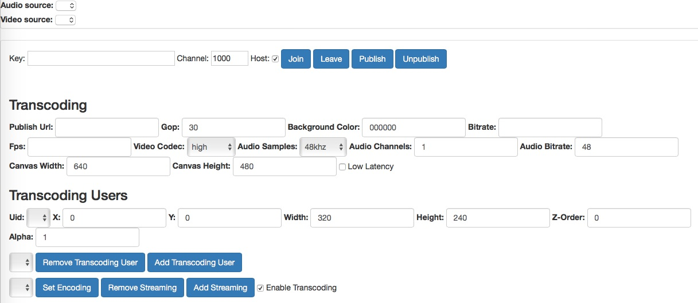
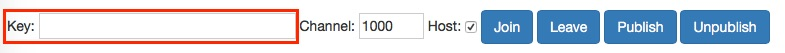
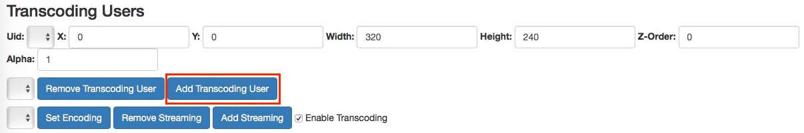
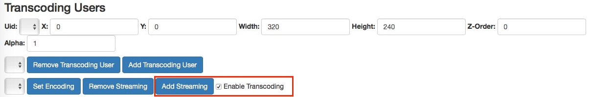

# Agora Interactive Broadcasting Tutorial for Web

This tutorial describes how to create an Agora account, download the SDK, and use the Agora sample app to integrate live streaming using the [Agora 2.0+ API](https://docs.agora.io/en/2.2/product/Voice/API%20Reference/communication_web_audio#voice-call-api).

With this sample app, you can:

- [Join calls](#create-the-join-method)
- [Leave calls](#create-the-leave-method)
- [Publish and unpublish streams](#create-the-publish-and-unpublish-methods)
- [Add user transcoding to start a live stream](#create-transcoding-methods)

## Prerequisites
- An Agora.io developer account
- A web server that supports SSL (https)

## Quick Start
This section shows you how to prepare, build, and run the sample application.

### Create an Account and Obtain an App ID
To build and run the sample application, first obtain an app ID: 

1. Create a developer account at [agora.io](https://dashboard.agora.io/signin/). Once you finish the sign-up process, you are redirected to the dashboard.
2. Navigate in the dashboard tree on the left to **Projects** > **Project List**.
3. Copy the app ID that you obtain from the dashboard into a text file. You will use this when you launch the app.

### Integrate the Agora Video SDK into the Sample Project

To use the Agora Video SDK, you must first integrate the Agora Video SDK into the sample project.

1. Download the Agora Video SDK from [Agora.io SDK](https://www.agora.io/en/download/). Under the **Video + Interactive Broadcasting SDK** heading, choose the **Web** download.
2. Unzip the downloaded SDK package.

	

3. Copy the `AgoraRTCSDK` .js file into the root of your GitHub project folder. The file will have a sample name similar to `AgoraRTCSDK-2.2.0.js`.

	**Note:** `2.2.0` is a placeholder for the version number of the SDK .js file you downloaded.
	
### Update and Run the Sample Application 

1. Open the `index.html` file in a code editor.
2. At the top of the file, in the `<head>` section, make sure the JavaScript file source is now `AgoraRTCSDK-2.2.0.js`. Ensure the `2.2.0` placeholder is the version number of the SDK .js file you downloaded.

	**Before**

	``` JavaScript
  	<script src="AgoraRTCSDK-2.1.0.js"></script>
	```

	**After**

	``` JavaScript
	<script src="build/AgoraRTC-2.2.0.js"></script>
	```
	
3. Deploy the project on a web server. Make sure you access the page through an SSL (https) connection. The Agora SDK requires a secure connection to use the audio and video devices connected to the browser.
4. Use your browser to navigate to the `index.html` file. After you load the sample app, your browser looks like this:

	

5. In your browser window, paste the `AppID` into the **Key** UI text field.

	

6. Add your RTMP server URL into the **Publish Url** field.

	

7. Press the **Join** UI button to join the call. As soon as someone else joins the call, the call starts, and you and the other caller can see each other in the browser window.

	**Note:** If your sample app must be accessible on mobile browsers, ensure the [`createClient`](https://docs.agora.io/en/2.2/product/Voice/API%20Reference/communication_web_audio#voice-call-api) method is called with the proper `mode`. See [Create the Join Method](#create-the-join-method). For more information, see the [Agora API documentation](https://docs.agora.io/en/).

8. To add an existing user to the live stream video, press **Add Transcoding User**. Use the transcoding user configuration fields to modify the user's frame position and size.

	

9. To start a live stream with the same transcoding settings, press **Add Streaming**.

	

## Steps to Create the Sample

- [Create Visual Assets and Connect External Scripts](#create-visual-assets-and-connect-external-scripts)
- [Design the User Interface](#design-the-user-interface)
- [System Requirements, Logging, and Global Variables](#system-requirements-logging-and-global-variables)
- [Initialize the Application](#initialize-the-application)
- [Create Conversion Methods](#create-conversion-methods)
- [Create Transcoding, Streaming, and Encoding Methods](#create-transcoding-streaming-and-encoding-methods)
- [Create the UI Update Method](#create-ui-update-method)
- [Create the Join Method](#create-the-join-method)
- [Create the Leave Method](#create-the-leave-method)
- [Create the Publish and Unpublish Methods](#create-the-publish-and-unpublish-methods)

### Create Visual Assets and Connect External Scripts

Add the following icon assets for the user interface to the **assets** folder:

Asset|Description                                                                                        
---|---
`mute48.png`|An icon of a muted microphone to mute audio
`sound48.png`|An icon of an unmuted microphone to unmute audio


The sample application uses three external libraries:

File Path|Description
---|---
`vendor/bootstrap.min.css`|A bootstrap stylesheet for a responsive web UI
`AgoraRTCSDK-2.1.0.js`|The Agora Web SDK. Ensure the `2.1.0` placeholder is the version number of the SDK .js file you downloaded.
`vendor/jquery.js`|A JQuery library

``` HTML
<!DOCTYPE html>
<html>

<head>
  <title>Agora Live Streaming Web Sample</title>
  <link rel="stylesheet" href="vendor/bootstrap.min.css">
  <script src="AgoraRTCSDK-2.1.0.js"></script>
  <script src="vendor/jquery.js"></script>
</head>

<body>
	
	...
	
</body>

</html>
```

The remaining code for this tutorial is contained within the `<body>` tags.

### Design the User Interface

The sample application contains four main sections.

Section|Description
---|---
Top UI section|General application settings; video call configuration and controls
Transcoding UI section|Transcoding configuration and controls for the current user
Transcoding Users UI section|Transcoding configuration and controls for other users
Video Display area|An area to add and display the video objects

- [Build the Top UI Section](#build-the-top-ui-section)
- [Build the Transcoding UI Section](#build-the-transcoding-ui-section)
- [Build the Transcoding Users UI Section](#build-the-transcoding-users-ui-section)
- [Build the Video Display Area](#build-the-video-display-area)

#### Build the Top UI Section

The key UI elements that determine the application settings and video configurations are listed below:

Element ID|Element Type|Description
---|---|---
`audioSource`|`<select>`|A select menu to choose the audio source
`videoSource`|`<select>`|A Select menu to choose the video source
`key`|`<input type="text">`|Text input for the Agora API key
`channel`|`<input type="text">`|Text input for the channel number
`video`|`<input type="checkbox">`|A checkbox to indicate if the user is the host

``` HTML
  <div id="div_device" class="panel panel-default">
    <div class="select">
      <label for="audioSource">Audio source: </label>
      <select id="audioSource"></select>
    </div>
    <div class="select">
      <label for="videoSource">Video source: </label>
      <select id="videoSource"></select>
    </div>
  </div>

  <div id="div_join" class="panel panel-default">
    <div class="panel-body">
      Key:
      <input id="key" type="text" value="" size="36"></input>
      Channel:
      <input id="channel" type="text" value="1000" size="4"></input>
      Host:
      <input id="video" type="checkbox" checked></input>
      
      ...

    </div>

  </div>
```

The following buttons are contained just before the closing `</div>` tag shown above. These buttons invoke methods that interact with the Agora SDK. 

Button Name|Button ID|Method|Description
---|---|---|---
Join|`join`|`join()`|Joins the channel
Leave|`leave`|`leave()`|Leaves the channel
Publish|`publish`|`publish()`|Publishes the stream
Unpublish|`unpublish`|`unpublish()`|Unpublishes the stream

``` HTML
      <button id="join" class="btn btn-primary" onclick="join()">Join</button>
      <button id="leave" class="btn btn-primary" onclick="leave()">Leave</button>
      <button id="publish" class="btn btn-primary" onclick="publish()">Publish</button>
      <button id="unpublish" class="btn btn-primary" onclick="unpublish()">Unpublish</button>
```

#### Build the Transcoding UI Section

This section defines the key UI elements that determine transcoding configuration and controls for the current user.

The following UI elements determine the basic video settings:

Element ID|Element Type|Description
---|---|---
`live_streaming_url`|`<input>`|Text input for the URL of the live stream
`live_streaming_gop`|`<input>`|Text input for the Gop of the live stream
`live_streaming_bg_color`|`<input>`|Text input for the background color of the stream
`live_streaming_bitrate`|`<input>`|Text input for the stream's bit rate
`live_streaming_fps`|`<input>`|Text input for the stream's frames per second
`live_streaming_codec`|`<select>`|A select menu for the stream's codec

``` HTML
    <div class="panel-body">
      <div id="js_live_streaming_box">
        <div class="form-inline">
          <h3>Transcoding</h3>
          <div class="form-group">
            <label>Publish Url: </label>
            <input class="form-control" name="" id="live_streaming_url" value=""></input>
          </div>
          <div class="form-group">
            <label>Gop: </label>
            <input class="form-control" name="" id="live_streaming_gop" value="30"></input>
          </div>

          <div class="form-group">
            <label>Background Color: </label>
            <input class="form-control" name="" id="live_streaming_bg_color" value="000000"></input>
          </div>
          <div class="form-group">
            <label>Bitrate: </label>
            <input class="form-control" name="" id="live_streaming_bitrate" value=""></input>
          </div>
          <div class="form-group">
            <label>Fps: </label>
            <input class="form-control" name="" id="live_streaming_fps" value=""></input>
          </div>
          <div class="form-group">
            <label>Video Codec: </label>
            <select class="form-control" name="" id="live_streaming_codec">
              <option value="66">baseline</option>
              <option value="77">main</option>
              <option value="100" selected>high</option>
            </select>
          </div>

	       ...

        </div>
        
        ...
        
      </div>
    </div>      

```

The following UI elements determine the audio settings:

Element ID|Element Type|Description
---|---|---
`live_streaming_audio_samples`|`<select>`|A select menu for the stream's audio sample rate
`live_streaming_audio_channels`|`<input>`|Text input for the audio channels
`live_streaming_audio_bitrate`|`<input>`|Text input for the audio bit rate

``` HTML
          <div class="form-group">
            <label>Audio Samples: </label>
            <select class="form-control" name="" id="live_streaming_audio_samples">
              <option value="32000">32khz</option>
              <option value="44100">44.1khz</option>
              <option value="48000" selected>48khz</option>
            </select>
          </div>
          <div class="form-group">
            <label>Audio Channels: </label>
            <input class="form-control" name="" id="live_streaming_audio_channels" value="1"></input>
          </div>
          <div class="form-group">
            <label>Audio Bitrate: </label>
            <input class="form-control" name="" id="live_streaming_audio_bitrate" value="48"></input>
          </div>
```

The following UI elements determine the size and latency of the video:

Element ID|Element Type|Description
---|---|---
`live_streaming_canvas_width`|`<input>`|Text input for the canvas width
`live_streaming_canvas_height`|`<input>`|Text input for the canvas height
`live_streaming_low_latency`|`<input type="checkbox">`|A checkbox to set the stream to low latency

``` HTML
          <div class="form-group">
            <label>Canvas Width: </label>
            <input class="form-control" name="" id="live_streaming_canvas_width" value="640"></input>
          </div>
          <div class="form-group">
            <label>Canvas Height: </label>
            <input class="form-control" name="" id="live_streaming_canvas_height" value="480"></input>
          </div>
          <div class="checkbox">
            <label>
              <input type="checkbox" id="live_streaming_low_latency"> Low Latency
            </label>
          </div>
```

#### Build the Transcoding Users UI Section

This section defines key UI elements that determine transcoding configuration and controls for other users.

The following UI elements determine the transcoding user visual settings:

Element ID|Element Type|Description
---|---|---
`live_streaming_user_uid`|`<select>`|A select menu for the list of users
`live_streaming_user_x`|`<input>`|Text input for the x location of the user's stream
`live_streaming_user_y`|`<input>`|Text input for the y location of the user's stream
`live_streaming_user_width`|`<input>`|Text input for the width of the user's stream
`live_streaming_user_height`|`<input>`|Text input for the height of the user's stream
`live_streaming_user_z`|`<input>`|Text input for the z index of the user's stream
`live_streaming_user_alpha`|`<input>`|Text input for the alpha value of the user's stream

``` HTML
        <div class="form-inline" style="margin-top: 10px">
          <h3>Transcoding Users</h3>
          <div class="form-group">
            <label>Uid: </label>
            <select class="form-control" name="" id="live_streaming_user_uid"></select>
          </div>
          <div class="form-group">
            <label>X: </label>
            <input class="form-control" name="" id="live_streaming_user_x" value="0"></input>
          </div>
          <div class="form-group">
            <label>Y: </label>
            <input class="form-control" name="" id="live_streaming_user_y" value="0"></input>
          </div>
          <div class="form-group">
            <label>Width: </label>
            <input class="form-control" name="" id="live_streaming_user_width" value="320"></input>
          </div>
          <div class="form-group">
            <label>Height: </label>
            <input class="form-control" name="" id="live_streaming_user_height" value="240"></input>
          </div>
          <div class="form-group">
            <label>Z-Order: </label>
            <input class="form-control" name="" id="live_streaming_user_z" value="0"></input>
          </div>
          <div class="form-group">
            <label>Alpha: </label>
            <input class="form-control" name="" id="live_streaming_user_alpha" value="1"></input>
          </div>
        </div>
```

The following UI elements manage transcoding users:

Element ID|Element Type|Description
---|---|---
`live_streaming_users_list`|`<select>`|A select menu for the list of transcoding users
`live_streaming_user_remove`|`<button>`|Button to remove a transcoding user
`live_streaming_user_add`|`<button>`|Button to add a streaming user

``` HTML
        <div class="form-inline" style="margin-top: 10px">
          <div class="form-group">
            <select class="form-control" name="" id="live_streaming_users_list"></select>
          </div>
          <div class="form-group">
            <button type="button" class="btn btn-primary" id="live_streaming_user_remove">Remove Transcoding User</button>
          </div>
          <div class="form-group">
            <button type="button" class="btn btn-primary" id="live_streaming_user_add">Add Transcoding User</button>
          </div>
        </div>
```

The following UI elements manage streaming users:

Element ID|Element Type|Description
---|---|---
`live_streaming_list`|`<select>`|A select menu input for streaming users
`live_streaming_set_encoding`|`<button>`|A button to set the encoding for a streaming user
`live_streaming_stop_streaming`|`<button>`|A button to remove a streaming user
`live_streaming_start_streaming`|`<button>`|A button to add a streaming user
`live_streaming_enable_transcoding`|`<input type="checkbox">`|A checkbox to enable transcoding for a user

``` HTML
        <div class="form-inline" style="margin-top: 10px">
          <div class="form-group">
            <select class="form-control" name="" id="live_streaming_list"></select>
          </div>
          <div class="form-group">
            <button type="button" class="btn btn-primary" id="live_streaming_set_encoding">Set Encoding</button>
          </div>
          <div class="form-group">
            <button type="button" class="btn btn-primary" id="live_streaming_stop_streaming">Remove Streaming</button>
          </div>
          <div class="form-group">
            <button type="button" class="btn btn-primary" id="live_streaming_start_streaming">Add Streaming</button>
          </div>
          <div class="checkbox">
            <label>
              <input type="checkbox" id="live_streaming_enable_transcoding" checked> Enable Transcoding
            </label>
          </div>
        </div>
```

#### Build the Video Display Area

The `video` `div` element is the location where video stream objects are added.

The `agora_local` `div` element is where the local video object displays.

``` HTML
  <div id="video" style="margin:0 auto;">
    <div id="agora_local" style="float:right;width:210px;height:147px;display:inline-block;"></div>
  </div>
```

### System Requirements, Logging, and Global Variables

The base JavaScript class of the Agora Web SDK is `AgoraRTC`, which enables the use of the Agora Web SDK communication functionality. The code in this section is within the `<script>` tags.

``` HTML
  <script language="javascript">
  
	 ...
  
  </script>
```

#### Check System Requirements

Agora requires WebRTC to run. To alert users that their browser does not support WebRTC, call the [`AgoraRTC.checkSystemRequirements()`](https://docs.agora.io/en/2.2/product/Voice/API%20Reference/communication_web_audio#voice-call-api) method.

``` HTML
    if (!AgoraRTC.checkSystemRequirements()) {
      alert("browser is no support webRTC");
    }
```

#### Set Up Logging

Set up logging using `AgoraRTC.Logger`. The various log types are listed below:

Log Method|Description
---|---
`AgoraRTC.Logger.error()`|Error log
`AgoraRTC.Logger.warning('')`|Warning log
`AgoraRTC.Logger.info('')`|Information log
`AgoraRTC.Logger.debug('')`|Debug log

``` JavaScript
    /* simulated data to proof setLogLevel() */
    AgoraRTC.Logger.error('this is error');
    AgoraRTC.Logger.warning('this is warning');
    AgoraRTC.Logger.info('this is info');
    AgoraRTC.Logger.debug('this is debug');
```

#### Define Global Variables

Define the global variables for the sample application:

Variable|Description
---|---
`client`|The Agora client object
`localStream`|The local stream object
`camera`|The current video source
`microphone`|The current audio source
`uids`|An array of users
`transcodingUsers`|An array of transcoding users
`streams`|An array of user streams
`publishUrl`|The Real-Time Messaging Protocol (RTMP) URL to push to
`audioSelect`|The audio select UI menu
`videoSelect`|The video select UI menu

``` JavaScript
    var client, localStream, camera, microphone;
    var uids = [], transcodingUsers = [];
    var streams = [];
    var publishUrl = "YOUR_RTMP_PUSH_URL";

    var audioSelect = document.querySelector('select#audioSource');
    var videoSelect = document.querySelector('select#videoSource');
    
    ...
```

### Initialize the Application


#### Create the Default Encoding Method

The `setDefaultEncoding()` method sets the default RTMP URL, bit rate, and frames-per-second values for the text input UI elements `live_streaming_url`, `live_streaming_bitrate`, and `live_streaming_fps`.

``` JavaScript
    function setDefaultEncoding() {
      var width = 640,
        height = 480,
        framerate = 30,
        bitrate = 750;

      $("#live_streaming_url").val(publishUrl);
      $("#live_streaming_bitrate").val(bitrate);
      $("#live_streaming_fps").val(framerate);
    }
```

#### Create Device Setup Method

The `getDevices()` method populates the audio and video selection menu UI elements `audioSelect` and `videoSelect`.

`AgoraRTC.getDevices()` retrieves a list of available devices.

- If the device is an audio device specified by `device.kind === 'audioinput'`, add the device to the `audioSelect` menu using `audioSelect.appendChild()`.
- If the device is an audio device specified by `device.kind === 'videoinput'`, add the device to the `videoSelect` menu using `videoSelect.appendChild()`.
- If the device is not an audio or a video device, log the device to the console using `console.log()`.

``` JavaScript
    function getDevices() {
      AgoraRTC.getDevices(function (devices) {
        for (var i = 0; i !== devices.length; ++i) {
          var device = devices[i];
          var option = document.createElement('option');
          option.value = device.deviceId;
          if (device.kind === 'audioinput') {
            option.text = device.label || 'microphone ' + (audioSelect.length + 1);
            audioSelect.appendChild(option);
          } else if (device.kind === 'videoinput') {
            option.text = device.label || 'camera ' + (videoSelect.length + 1);
            videoSelect.appendChild(option);
          } else {
            console.log('Some other kind of source/device: ', device);
          }
        }
      });
    }
```

#### Initialize UI Menus

Invoke `getDevices()` and `setDefaultEncoding()` to initialize the UI for the sample application.

``` JavaScript
    getDevices();
    setDefaultEncoding();
```

### Create Conversion Methods

The methods in this section are helper methods used in calculations for the sample application.

The `toInt()` method converts `val` into an integer using `parseInt()`. Return the resulting `value` if it is valid; otherwise, return `0`.

``` JavaScript
    //utils
    function toInt(val) {
      var value = parseInt(val);
      if (isNaN(value)) {
        return 0;
      } else {
        return value;
      }
    }
```

The `toInt()` method converts `val` into a float using `parseFloat()`. Return the resulting `value` if it is valid; otherwise, return `0`.

``` JavaScript
    function toFloat(val) {
      var value = parseFloat(val);
      if (isNaN(value)) {
        return 0;
      } else {
        return value;
      }
    }
```

### Create Transcoding, Streaming, and Encoding Methods

- [Create Transcoding Methods](#create-transcoding-methods)
- [Create Streaming Methods](#create-streaming-methods)
- [Encoding Method](#encoding-method)

#### Create Transcoding Methods

The `addTranscodingUser()` method adds a transcoding user to the sample application. This method is invoked by the [`live_streaming_user_add` UI button](#build-the-transcoding-users-ui-section).

Add a `user` to the `transcodingUsers` array using `push()` and update the UI using `onContextUpdate()`.

``` JavaScript
    //live-streaming related
    function addTranscodingUser(user) {
      transcodingUsers = transcodingUsers || [];
      transcodingUsers.push(user);
      onContextUpdate();
    }
```

The `removeTranscodingUser()` method removes a transcoding user from the sample application. This method is invoked by the [`live_streaming_user_remove` UI button](#build-the-transcoding-users-ui-section).

1. Find the index of the selected user using `$("#live_streaming_users_list").val()`.
2. Remove the user from the `transcodingUsers` array based on `selectedIdx` and using `splice()`.
3. Update the UI using `onContextUpdate()`.

``` JavaScript
    function removeTranscodingUser() {
      var selectedIdx = $("#live_streaming_users_list").val();
      transcodingUsers.splice(selectedIdx, 1);
      onContextUpdate();
    }
```

The `calcTranscoding()` method returns an object of properties for transcoding.

Retrieve the background color value by using `$("#live_streaming_bg_color").val()`. Convert the `bgcolor` to an integer using `parseInt()`. If the background color is invalid, set the `bgcolor` to `0`.

Create a `coding` properties object and set the following properties:

Property Name|Value|Description
---|---|---
`width`|`toInt($("#live_streaming_canvas_width").val())`|Canvas width
`height`|`toInt($("#live_streaming_canvas_height").val())`|Canvas height
`videoFramerate`|`toInt($("#live_streaming_fps").val())`|Frames per second
`videoBitrate`|`toInt($("#live_streaming_bitrate").val())`|Bit rate
`userCount`|`transcodingUsers.length`|User count
`transcodingUsers`|`transcodingUsers`|Transcoding users array
`audioBitrate`|`toInt($("#live_streaming_audio_bitrate").val())`|Audio bit rate
`audioChannels`|`toInt($("#live_streaming_audio_channels").val())`|Audio channels
`audioSampleRate`|`toInt($("#live_streaming_audio_samples").val())`|Audio sample rate
`backgroundColor`|`bgcolor`|Background color
`lowLatency`|`$("#live_streaming_low_latency").prop("checked")`|Low latency enabled/disabled
`userConfigExtraInfo`|`{}`|Extra information for configuration
`videoCodecProfile`|`toInt($("#live_streaming_codec").val())`|Video codec
`videoGop`|`toInt($("#live_streaming_gop").val())`|Video Gop

**Note:** Most of the property values are converted to integers using `toInt()`.

Complete the method by returning the  `coding` properties object:

``` JavaScript
    function calcTranscoding() {
      transcodingUsers = transcodingUsers || [];
      var bgcolor = $("#live_streaming_bg_color").val();
      //color is int type and should be parsed as 16 base
      bgcolor = parseInt(bgcolor, 16);

      if (isNaN(bgcolor)) {
        bgcolor = 0;
      }

      var coding = {
        width: toInt($("#live_streaming_canvas_width").val()),
        height: toInt($("#live_streaming_canvas_height").val()),
        videoFramerate: toInt($("#live_streaming_fps").val()),
        videoBitrate: toInt($("#live_streaming_bitrate").val()),
        userCount: transcodingUsers.length,
        transcodingUsers: transcodingUsers,
        audioBitrate: toInt($("#live_streaming_audio_bitrate").val()),
        audioChannels: toInt($("#live_streaming_audio_channels").val()),
        audioSampleRate: toInt($("#live_streaming_audio_samples").val()),
        backgroundColor: bgcolor,
        lowLatency: $("#live_streaming_low_latency").prop("checked"),
        userConfigExtraInfo: {},
        videoCodecProfile: toInt($("#live_streaming_codec").val()),
        videoGop: toInt($("#live_streaming_gop").val())
      };

      return coding;
    }
```

The `setTranscoding()` method retrieves the `coding` property values using `calcTranscoding()`. Apply it to the Agora `client` using `client.setLiveTranscoding()`.

``` JavaScript
    function setTranscoding() {
      var coding = calcTranscoding();
      client.setLiveTranscoding(coding);
    }
```

#### Create Streaming Methods


The `addStreaming()` method adds a streaming user. This method is invoked by the [`live_streaming_start_streaming` UI button](#build-the-transcoding-users-ui-section).

1. Check if the user is already streaming using `streams.indexOf(url) !== -1`. If the user is streaming, display an alert using `alert()`.
2. Check if transcoding is enabled:
	- If `enableTranscoding` is `false`, start the live stream by passing `false` into `client.startLiveStreaming()`.
	- If `enableTranscoding` is `true`, apply the `transcoding` property object to the `client` using `client.setLiveTranscoding()` and start the live stream by passing `true` into `client.startLiveStreaming()`.

Add the `url` to the `streams` array using `push()` and update the UI using `onContextUpdate()`.

``` JavaScript
    function addStreaming(url, enableTranscoding) {
      streams = streams || [];

      if (streams.indexOf(url) !== -1) {
        alert("Streaming exists already");
        return;
      }

      if (!enableTranscoding) {
        client.startLiveStreaming(url, false);
      } else {
        var transcoding = calcTranscoding();
        client.setLiveTranscoding(transcoding);
        client.startLiveStreaming(url, true);
      }
      streams.push(url);
      onContextUpdate();
    }
```

The `removeStreaming()` method stops a user from streaming. This method is invoked by the [`live_streaming_stop_streaming` UI button](#build-the-transcoding-users-ui-section).

1. Find the index of the selected user using `$("#live_streaming_list").val()`.
2. Remove the streaming user from the `streams` array based on `selectedIdx` and using `splice()`.
3. Update the UI using `onContextUpdate()`.
4. Stop the live streaming for the user using `client.stopLiveStreaming()`.

``` JavaScript
    function removeStreaming() {
      var selectedIdx = $("#live_streaming_list").val();
      var url = streams.splice(selectedIdx, 1)[0];
      onContextUpdate();
      client.stopLiveStreaming(url);
    }
```

#### Encoding Method

The `setEncoding()` method sets the encoding for the Agora `client` by applying the transcoding property object `coding` using `client.setLiveTranscoding()`.

``` JavaScript
    function setEncoding() {
      var coding = calcTranscoding();
      client.setLiveTranscoding(coding);
    }
```

### Create the UI Update Method

The `onContextUpdate()` method updates the UI as the lists of users and their settings are updated.

Update the users list:

1. Clear the users list using `$("#live_streaming_user_uid").html()`.
2. Iterate through the users and append the `uids` as an `<option>` tag using `$("#live_streaming_user_uid").append()`.

Update the transcoding users list:

1. Clear the transcoding users list using `$("#live_streaming_users_list").html()`.
2. Iterate through the transcoding users and append the `transcodingUsers` as an `<option>` tag using `$("#live_streaming_users_list").append()`.

Update the streaming users list:

1. Clear the streaming users list using `$("#live_streaming_list").html()`
2. Iterate through the streaming users and append the `streams` as an `<option>` tag using `$("#live_streaming_list").append()`.

``` JavaScript
    function onContextUpdate() {
      var i = 0;
      //redraw uid list
      $("#live_streaming_user_uid").html("");
      for (i = 0; i < uids.length; i++) {
        $("#live_streaming_user_uid").append("<option value='" + uids[i] + "'>" + uids[i] + "</option>");
      }

      //redraw transcoding user list
      $("#live_streaming_users_list").html("");
      for (var i = 0; i < transcodingUsers.length; i++) {
        $("#live_streaming_users_list").append("<option value=\"" + i + "\">" + (i + 1) + " - " + transcodingUsers[i].uid + "</option>");
      }

      //redraw stream list
      $("#live_streaming_list").html("");
      for (var i = 0; i < streams.length; i++) {
        $("#live_streaming_list").append("<option value=\"" + i + "\">" + (i + 1) + " - " + streams[i] + "</option>");
      }
    }
```

### Create the Join Method

The `join()` method joins a user to the Agora `client`.

Disable the `join` and `video` UI elements by setting the `disabled` property to `true` and initialize the `channel_key` to `null`.

Create the `client` with the `interop` mode using `AgoraRTC.createClient()` and initialize it with the `key.value` using `client.init()`.

The remaining code in this section adds additional event listeners and callbacks. It is within the `client.init()` callback and at the end of the `join()` method.

- [Add Join Functionality](#add-join-functionality)
- [Add Join Event Listeners and Callbacks](#add-join-event-listeners-and-callbacks)
- [Add Button Event Listeners and Callbacks](#add-button-event-listeners-and-callbacks)

``` JavaScript
    function join() {
      document.getElementById("join").disabled = true;
      document.getElementById("video").disabled = true;
      var channel_key = null;

      console.log("Init AgoraRTC client with vendor key: " + key.value);
      client = AgoraRTC.createClient({ mode: 'interop' });
      
      client.init(key.value, function () {
        console.log("AgoraRTC client initialized");
        
        ...
      		
      }, function (err) {
        console.log("AgoraRTC client init failed", err);
      });
      
      ...
      
    }
```

#### Add Join Functionality

The `client.join()` method joins a user to the channel. Because this method occurs after the `client` is initialized, set the `uids` array to contain just this user's `uid`.

If the `video` UI checkbox is checked, set the device and stream properties. The next set of code explains how to do this for the sample application.

``` JavaScript        
        client.join(channel_key, channel.value, null, function (uid) {
          console.log("User " + uid + " join channel successfully");
          uids = [uid];
          onContextUpdate();
          
          if (document.getElementById("video").checked) {
        
        		...
        	
          }        	
        }, function (err) {
          console.log("Join channel failed", err);
        });
```

Create and set the stream properties:

1. Set the current video source `camera` to `videoSource.value`.
2. Set the current audio source `microphone` to `audioSource.value`.
3. Create a new stream for the user `uid` and apply the video and audio sources using `AgoraRTC.createStream()`.
4. If the `video` UI element is checked, set the video profile to `720p_3` using `localStream.setVideoProfile()`.

``` JavaScript
            camera = videoSource.value;
            microphone = audioSource.value;
            localStream = AgoraRTC.createStream({ streamID: uid, audio: true, cameraId: camera, microphoneId: microphone, video: document.getElementById("video").checked, screen: false });
            if (document.getElementById("video").checked) {
              localStream.setVideoProfile('720p_3');

            }
```

Add event listeners to the stream using `localStream.on()` and add console logs to the callbacks using `console.log()`.

Event Listener|Description
---|---
`accessAllowed`|Allows access for the stream
`accessDenied`|Denies access for the stream

``` JavaScript
            // The user has granted access to the camera and mic.
            localStream.on("accessAllowed", function () {
              console.log("accessAllowed");
            });

            // The user has denied access to the camera and mic.
            localStream.on("accessDenied", function () {
              console.log("accessDenied");
            });
```

Initialize the local stream using `localStream.init()`.

If the callback is successful:

1. Add a success message to the console log using `console.log()`.
2. Publish the local stream using `client.publish()`.
3. Add a `stream-published` event listener using `client.on()`.

If the callback fails, add a console log for the error `err` using `console.log`.

``` JavaScript
            localStream.init(function () {
              console.log("getUserMedia successfully");
              localStream.play('agora_local');

              client.publish(localStream, function (err) {
                console.log("Publish local stream error: " + err);
              });

              client.on('stream-published', function (evt) {
                console.log("Publish local stream successfully");
              });
            }, function (err) {
              console.log("getUserMedia failed", err);
            });
```

#### Add Join Event Listeners and Callbacks

The join event listeners and callbacks are placed at the end of the `join()` method.

Initialize `channelKey` to an empty string:

``` JavaScript
      channelKey = "";
```

- [Error Event](#error-event)
- [Stream Added Event](#stream-added-event)
- [Stream Subscribed Event](#stream-subscribed-event)
- [Stream Removed Event](#stream-removed-event)
- [Peer Leave Event](#peer-leave-event)
- [Live Streaming Events](#live-streaming-events)

##### Error Event

The `error` event listener is triggered when an error occurs on the Agora `client`.

Log the cause of the error `err.reason` using `console.log()`. If the reason for the error is the expiration of the channel key specified by `DYNAMIC_KEY_TIMEOUT`, renew the `channelKey` using `client.renewChannelKey()`.

``` JavaScript
      channelKey = "";
      client.on('error', function (err) {
        console.log("Got error msg:", err.reason);
        if (err.reason === 'DYNAMIC_KEY_TIMEOUT') {
          client.renewChannelKey(channelKey, function () {
            console.log("Renew channel key successfully");
          }, function (err) {
            console.log("Renew channel key failed: ", err);
          });
        }
      });
```

##### Stream Added Event

The `stream-added` event listener is triggered when a stream is added to the Agora `client`.

Add console logs for the `stream` and the stream ID `stream.getId()` using `console.log()`.

Subscribe the `stream` to the Agora `client` using `client.subscribe()`.

``` JavaScript
      client.on('stream-added', function (evt) {
        var stream = evt.stream;
        console.log("New stream added: " + stream.getId());
        console.log("Subscribe ", stream);
        client.subscribe(stream, function (err) {
          console.log("Subscribe stream failed", err);
        });
      });
```

##### Stream Subscribed Event

The `stream-subscribed` event listener is triggered when a stream is subscribed to the Agora `client`.

Display the stream ID `stream.getId()` in the console log using `console.log()`, add the stream ID to the `uids` array using `uids.push()`, and update the UI using `onContextUpdate()`.

Ensure that the stream's UI element is empty using `$('div#video #agora_remote' + stream.getId()).length === 0` before adding the video object to the stage using `$('div#video').append()`.

Complete the callback by playing the `stream` using `stream.play()`.

``` JavaScript
      client.on('stream-subscribed', function (evt) {
        var stream = evt.stream;
        console.log("Subscribe remote stream successfully: " + stream.getId());
        uids.push(stream.getId());
        onContextUpdate();
        if ($('div#video #agora_remote' + stream.getId()).length === 0) {
          $('div#video').append('<div id="agora_remote' + stream.getId() + '" style="float:left; width:810px;height:607px;display:inline-block;"></div>');
        }
        stream.play('agora_remote' + stream.getId());
      });
```

##### Stream Removed Event

The `stream-removed` event listener is triggered when a stream is removed from the Agora` client`.

1. Stop the stream using `stream.stop()`.
2. Remove the stream UI object using `$('#agora_remote' + stream.getId()).remove()`.
3. Retrieve the index of the stream using `uids.indexOf()` and remove it from the `uids` array using `uids.splice()`.
4. Update the UI using `onContextUpdate()`.
5. Log the stream ID to confirm its removal using `console.log()`.

``` JavaScript
      client.on('stream-removed', function (evt) {
        var stream = evt.stream;
        stream.stop();
        $('#agora_remote' + stream.getId()).remove();
        var idx = uids.indexOf(stream.getId());
        uids.splice(idx, 1);
        onContextUpdate();
        console.log("Remote stream is removed " + stream.getId());
      });
```

##### Peer Leave Event

The `peer-leave` event listener is triggered when a peer is removed from the Agora `client`.

1. Verify the `stream` is valid.

2. Stop the `stream` using `stream.stop()`.
3. Remove the stream's UI element from the stage using `$('#agora_remote' + stream.getId()).remove()`.
4. Log the user ID to the console using `console.log()`.

``` JavaScript
      client.on('peer-leave', function (evt) {
        var stream = evt.stream;
        if (stream) {
          stream.stop();
          $('#agora_remote' + stream.getId()).remove();
          console.log(evt.uid + " leaved from this channel");
        }
      });
```

##### Live Streaming Events

The `liveStreamingStarted` event listener is triggered when a live stream begins. Add a log to the console using `console.log()` to indicate the stream has started.

``` JavaScript
      //live streaming events..
      client.on('liveStreamingStarted', function (evt) {
        console.log("Live streaming started");
      });  // streaming start callback
```

The `liveStreamingFailed` event listener is triggered when a live stream fails. Add a log to the console using `console.log()` to indicate the stream failure.

``` JavaScript
      client.on('liveStreamingFailed', function (evt) {
        console.log("Live streaming failed");
      });  // streaming fail callback
```

The `liveStreamingStopped` event listener is triggered when a live stream stops. Add a log to the console using `console.log()` to indicate the stream has stopped.

``` JavaScript
      client.on('liveStreamingStopped', function (evt) {
        console.log("Live streaming stopped");
      });  // streaming stop callback
```

The `liveTranscodingUpdated` event listener is triggered when a live stream is updated. Add a log to the console using `console.log()` to indicate the stream has been updated.

``` JavaScript
      client.on('liveTranscodingUpdated', function (evt) {
        console.log("Live streaming updated");
      });  // streaming live transcoding update calback
```

#### Add Button Event Listeners and Callbacks

- [Streaming User Add Event Listener and Callback](#streaming-user-add-event-listener-and-callback)
- [Streaming User Remove Event Listener and Callback](#streaming-user-remove-event-listener-and-callback)
- [Start Streaming Event Listener and Callback](#start-streaming-event-listener-and-callback)
- [Stop Streaming Event Listener and Callback](#stop-streaming-event-listener-and-callback)
- [Set Streaming Encoding Event Listener and Callback](#set-streaming-encoding-event-listener-and-callback)

##### Streaming User Add Event Listener and Callback

The `live_streaming_user_add` event listener is triggered when the user clicks the `live_streaming_user_add` UI button.

Create a `coding` properties object and retrieve the following:

Property Name|Value|Description
---|---|---
`x`|`toInt($("#live_streaming_user_x").val())`|X location of the video
`y`|`toInt($("#live_streaming_user_y").val())`|Y location of the video
`width`|`toInt($("#live_streaming_user_width").val())`|Width of the video
`height`|`toInt($("#live_streaming_user_height").val())`|Height of the video
`zorder`|`toInt($("#live_streaming_user_z").val())`|Z index of the video
`alpha`|`toFloat($("#live_streaming_user_alpha").val())`|Alpha value of the video
`uid`|`toInt($("#live_streaming_user_uid").val())`|User ID for the video stream

**Note:** Most of the property values are converted to integers using `toInt()`.

If the `coding.uid` is not valid, display an alert prompting the user to `provide a uid`. Otherwise, invoke `addTranscodingUser` applying the `coding` properties object.

``` JavaScript
      $('#live_streaming_user_add').off("click").on("click", function () {
        var coding = {
          x: toInt($("#live_streaming_user_x").val()),
          y: toInt($("#live_streaming_user_y").val()),
          width: toInt($("#live_streaming_user_width").val()),
          height: toInt($("#live_streaming_user_height").val()),
          zorder: toInt($("#live_streaming_user_z").val()),
          alpha: toFloat($("#live_streaming_user_alpha").val()),
          uid: toInt($("#live_streaming_user_uid").val())
        };
        if (!coding.uid) {
          alert("you have to provide a uid for transcoding user");
        } else {
          addTranscodingUser(coding);
        }
      });
```

##### Streaming User Remove Event Listener and Callback

The `live_streaming_user_remove` event listener is triggered when the user clicks the `live_streaming_user_remove` UI button and invokes the `removeTranscodingUser()` method.

``` JavaScript
      $('#live_streaming_user_remove').off("click").on("click", function () {
        removeTranscodingUser();
      });
```

##### Start Streaming Event Listener and Callback

The `live_streaming_start_streaming` event listener is triggered when the user clicks the `live_streaming_start_streaming` UI button. 

1. Retrieve the streaming URL using `$("#live_streaming_url").val()`.
2. Retrieve the enable transcoding value using `$("#live_streaming_enable_transcoding").prop("checked")`.
3. Invoke the `addStreaming()` method with the `url` and `enableTranscoding` parameter values.

``` JavaScript
      $('#live_streaming_start_streaming').off("click").on("click", function () {
        var url = $("#live_streaming_url").val();
        var enableTranscoding = $("#live_streaming_enable_transcoding").prop("checked");
        addStreaming(url, enableTranscoding);
      });
```

##### Stop Streaming Event Listener and Callback

The `live_streaming_stop_streaming` event listener is triggered when the user clicks the `live_streaming_stop_streaming` UI button and invokes the `removeStreaming()` method.

``` JavaScript
      $('#live_streaming_stop_streaming').off("click").on("click", function () {
        removeStreaming();
      });
```

##### Set Streaming Encoding Event Listener and Callback

The `live_streaming_set_encoding` event listener is triggered when the user clicks the `live_streaming_set_encoding` UI button and invokes the `setEncoding()` method.

``` JavaScript
      $('#live_streaming_set_encoding').off("click").on("click", function () {
        setEncoding();
      });
```

### Create the Leave Method

The `leave()` method exits the user from the channel. Set the `leave` element's `disabled` property to `true` and invoke `client.leave()`.

To determine if the leave action is successful, add console logs to the callbacks using `console.log()`.

``` JavaScript
    function leave() {
      document.getElementById("leave").disabled = true;
      client.leave(function () {
        console.log("Leavel channel successfully");
      }, function (err) {
        console.log("Leave channel failed");
      });
    }
```

### Create the Publish and Unpublish Methods

The `publish()` method publishes the local stream.

Set the `disabled` property of the `publish` UI element to `true`. Set the `disabled` property of the `unpublish` UI element to `false`.

To identify any publishing stream errors, invoke `client.publish()` and add a console log to the callback using `console.log()`. 

``` JavaScript
    function publish() {
      document.getElementById("publish").disabled = true;
      document.getElementById("unpublish").disabled = false;
      client.publish(localStream, function (err) {
        console.log("Publish local stream error: " + err);
      });
    }
```

The `unpublish()` method publishes the local stream.

Set the `disabled` property of the `publish` UI element to `false`. Set the `disabled` property of the `unpublish` UI element to `true`.

To identify any unpublishing stream errors, invoke `client.unpublish()` and add a console log to the callback using `console.log()`. 

``` JavaScript
    function unpublish() {
      document.getElementById("publish").disabled = false;
      document.getElementById("unpublish").disabled = true;
      client.unpublish(localStream, function (err) {
        console.log("Unpublish local stream failed" + err);
      });
    }
```

## Resources
* Find complete [API documentation at the Document Center](https://docs.agora.io/en/).
* [File bugs about this sample](https://github.com/AgoraIO/Advanced-Interactive-Broadcasting/issues).

## License
This software is under the MIT License (MIT). [View the license](LICENSE.md).
