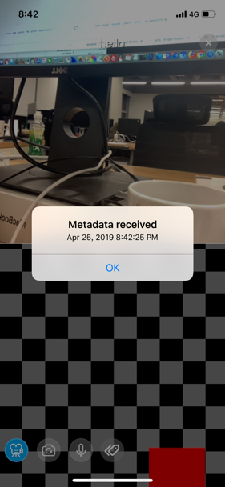

# Live Streaming Video Tags iOS for Swift

*其他语言: [中文](README.zh.md)*

This tutorial describes how to use video tags to deliver metadata/message via video frame.

With this sample app, you can:

- Join a channel
- Use Video Tags to deliver message to other device via video frame




## Prerequisites
- Xcode 10.0+
- Physical iOS device (iPhone or iPad)
	
	**Note:** Use a physical device to run the sample. Some simulators lack the functionality or the performance needed to run the sample.

## Quick Start

This section shows you how to prepare, build, and run the sample application.

- [Create an Account and Obtain an App ID](#create-an-account-and-obtain-an-app-id)
- [Update and Run the Sample Application](#update-and-run-the-sample-application) 


### Create an Account and Obtain an App ID
To build and run the sample application, you must obtain an app ID: 

1. Create a developer account at [agora.io](https://dashboard.agora.io/signin/). Once you finish the sign-up process, you are redirected to the dashboard.
2. Navigate in the dashboard tree on the left to **Projects** > **Project List**.
3. Copy the app ID that you obtained from the dashboard into a text file. You will use this when you launch the app.


### Update and Run the Sample Application 

1. Open `VideoTagsDemo.xcodeproj` and edit the `KeyCenter.swift` file. In the `agoraKit` declaration, update `<#Your App Id#>` with your app ID.

	``` Swift
    static let AppId: String = <#Your App Id#>
	```

2. Download the [Agora Video SDK](https://www.agora.io/en/download/). Unzip the downloaded SDK package and copy the `libs/AograRtcEngineKit.framework` file from the SDK folder into the sample application's `VideoTagsDemo` folder.
			
3. Connect your iPhone or iPad device and run the project. Ensure a valid provisioning profile is applied, or your project will not run.

## Resources
- Find full API documentation in the [Document Center](https://docs.agora.io/en/)
- [File bugs about this sample](https://github.com/AgoraIO/Advanced-Interactive-Broadcasting/issues)

## License
This software is licensed under the MIT License (MIT). [View the license](LICENSE.md).
